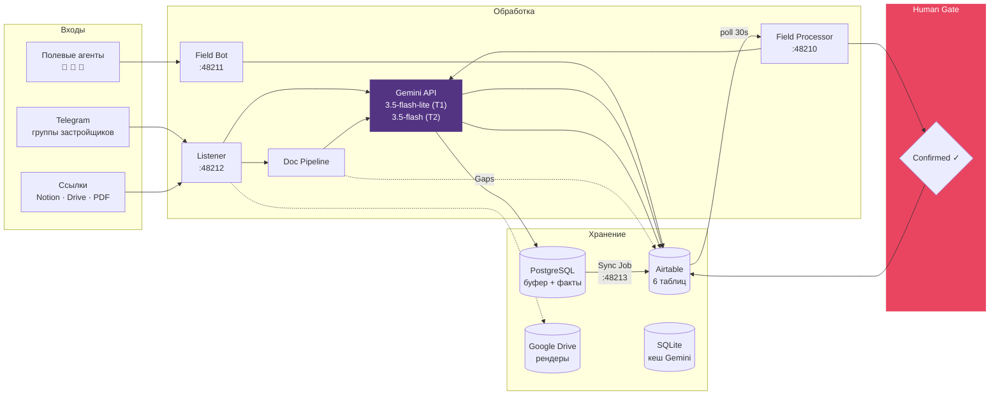
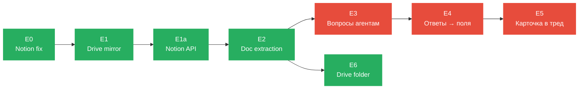

# 🤖 Bots RV — Полный аудит системы листинга

> **Стек:** Python 3.12 · Telethon · Gemini 3.5 Flash · Airtable · PostgreSQL · Redis · Docker  
> **Тесты:** 647 passed · **База:** `appsAbRs7DnYYWFt6` (Test) / `app2IEMPr6R3GelVP` (Prod)  
> **Стоимость:** ~$30-70/мес (Gemini API + Airtable)

---

## Архитектура — как данные текут



---

## 1. Четыре демона

### Listener — мониторинг Telegram 24/7
**Файл:** `app/listener.py` · **Порт:** 48212

- ✅ Слушает целевые TG-группы застройщиков через Telethon Userbot
- ✅ Предфильтрация regex (word boundary) → отсеивает мусор до отправки в Gemini
- ✅ Gemini `3.5-flash-lite` парсит сообщения → Developer / Project / Units JSON
- ✅ Буферизация в PostgreSQL со статусом `pending`
- ✅ Автоматический парсинг ссылок (Notion, Drive, Sheets, PDF, Dropbox)
- ✅ Backfill истории при подключении к новой группе
- ✅ `/card` — генерация карточки проекта прямо в чате
- ✅ Healthcheck HTTP :8080 (TG RPC ping + PG `SELECT 1`)

---

### Field Bot — полевой сбор
**Файл:** `field_bot.py` · **Порт:** 48211

- ✅ Приём фото (баннеры, стройка, рендеры)
- ✅ Приём голосовых записей
- ✅ GPS-локация + GPX-треки
- ✅ Генерация Folium HTML-карты обходов
- ✅ Карточка проекта: TG-пост + PDF (ReportLab)
- ✅ Запись в `Field Staging` со статусом `New`
- ✅ ACL whitelist + human-pause 60 мин

---

### Field Processor — AI-обработка находок
**Файл:** `field_processor.py` · **Порт:** 48210

- ✅ Polling `Field Staging` каждые 30 сек → `Status = New`
- ✅ Скачивание фото/аудио → Gemini с `FIELD_PROMPT`
- ✅ Транскрипция голоса + извлечение баннера (цены, BR, девелопер)
- ✅ Приоритизация: `Hight` если агент хвалит, `Low` если Green zone / нет PBG
- ✅ Дедупликация контактов по базе `Agencies`
- ✅ **Confirmed gate** → upsert Developer → Project → Units в основные таблицы

---

### Sync Job — пакетная выгрузка
**Файл:** `app/sync_job.py` · **Порт:** 48213

- ✅ PostgreSQL `pending` → Airtable через fuzzy match + upsert
- ✅ Retry до 3 раз, `DRY_RUN` режим

---

## 2. Модули ядра — 33 файла в `app/`

### AI & Парсинг
| Модуль | Что делает | ✅/⚠️ |
|---|---|---|
| `gemini_parser.py` | Pydantic-модели `DeveloperData/ProjectData/UnitData`, SYSTEM_PROMPT с районами Бали | ✅ |
| `content_cache.py` | SQLite-кеш ответов Gemini (экономия токенов) | ✅ |
| `priority_parser.py` | Голос → приоритет + юр.риски → `Hight/Medium/Low` | ✅ |

### Документы & Ссылки
| Модуль | Что делает | ✅/⚠️ |
|---|---|---|
| `link_fetcher.py` | Роутер URL: Notion API `loadCachedPageChunkV2`, Drive, Sheets, PDF | ✅ |
| `doc_pipeline.py` | Пайплайн: `empty_required_fields()` → файлы → extraction → `Gaps` | ✅ |
| `doc_router.py` | Классификация файлов + маршрутизация к пустым полям (бюджет N=5) | ✅ |
| `field_extractor.py` | Узкая экстракция 1 поля через `gemini-3.5-flash` + цитата | ✅ |
| `citations.py` | Валидация цитат: `OK` / `SPLICED` / `BAD` | ✅ |
| `doc_parser.py` | pypdf текст + vision fallback для сканов ≤50MB | ✅ |
| `doc_classification_registry.py` | PG-реестр: не переклассифицировать файл дважды | ✅ |
| `google_parser.py` | Google Sheets CSV + шахматка доступности | ✅ |

### Google Drive
| Модуль | Что делает | ✅/⚠️ |
|---|---|---|
| `drive_auth.py` | OAuth 2.0 + auto-refresh токена | ✅ |
| `drive_folder.py` | Рекурсивный обход папок/ярлыков Drive | ✅ |
| `drive_mirror.py` | Зеркалирование рендеров (без паспортов/KTP) | ✅ |

### Данные & Airtable
| Модуль | Что делает | ✅/⚠️ |
|---|---|---|
| `airtable_client.py` | TTL-кеш, динамическая схема, fuzzy match (>85%), upsert | ✅ |
| `database.py` | Asyncpg: пул, миграции, CRUD | ✅ |
| `schema_check.py` | Дрифт-валидатор: код ↔ live Airtable | ✅ |

### Нормализация
| Модуль | Что делает | ✅/⚠️ |
|---|---|---|
| `dedup.py` | Нормализация телефонов/доменов/хэндлов + матчинг по Agencies | ✅ |
| `phone_formatter.py` | +62 формат, WhatsApp-ссылки | ✅ |
| `naming.py` | Плейсхолдеры `Unknown Villa N`, swap координат, aliases | ✅ |
| `gaps.py` | Вычисление пустых обязательных полей | ✅ |
| `staging.py` | FSM: `needs_parsing()`, `should_promote()`, `promotion_blockers()` | ✅ |

### Инфраструктура
| Модуль | Что делает | ✅/⚠️ |
|---|---|---|
| `whatsapp_client.py` | Green-API WhatsApp (НЕ подключён, симуляция) | ⚠️ |
| `access.py` | ACL + 60-мин human-pause | ✅ |
| `card_generator.py` | TG-пост + PDF-карточка | ✅ |
| `healthcheck.py` | HTTP :8080 | ✅ |
| `history_scanner.py` | Backfill истории чата | ✅ |
| `single_instance.py` | TCP-мьютекс (4 порта) | ✅ |
| `export_airtable.py` | CSV-экспорт из PG | ✅ |
| `reparse_db.py` | Ре-парсинг сломанных extractions | ✅ |

---

## 3. Утилиты (`tools_*.py`) — 20+ скриптов

Все поддерживают `--apply` (без флага = dry run).

| Скрипт | Назначение |
|---|---|
| `tools_benchmark_models.py` | Бенчмарк 5 моделей Gemini на 6 ловушках |
| `tools_benchmark_vision.py` | Бенчмарк vision для PDF-сканов |
| `tools_clean_agency_phones.py` | Чистка wa.me → телефоны в `Agencies` |
| `tools_fix_agency_phones.py` | Форматирование +62 в `Agencies` |
| `tools_fix_developer_phones.py` | Форматирование +62 в `Developer` |
| `tools_fix_coordinates.py` | lat,lng → lng,lat для карты |
| `tools_fix_lease_terms.py` | Разделение Lease / Extension / Ownership |
| `tools_full_migration.py` | Полная миграция между базами |
| `tools_migrate_bases.py` | Валидированная миграция base→base |
| `tools_merge_duplicates.py` | Слияние дубликатов проектов |
| `tools_relink_developers.py` | Восстановление связей Project↔Developer |
| `tools_rename_placeholders.py` | `Villa` → `Unknown Villa N` + Aliases |
| `tools_sync_agencies.py` | Agencies ↔ Google Sheets |
| `tools_detach_baza_strays.py` | Отвязка чужих проектов от Bali Baza |
| `tools_list_baza_projects.py` | Категоризация проектов Baza |
| `tools_unmerge_unknown_developers.py` | Отвязка от Unknown Developer |
| `tools_test_field_pipeline.py` | E2E dry-run test |
| `tools_drive_auth_setup.py` | OAuth setup для Drive |
| `tools_print_projects.py` | Дебаг — список проектов |
| `manage.py` | CLI: `start/stop/status/logs` всех процессов |
| `check_duplicates.py` | Поиск дубликатов по именам |
| `performance_tests.py` | Бенчмарк латентности API |

---

## 4. Pipeline фазы — что сделано, что в планах



| Фаза | Описание | Статус |
|---|---|---|
| **E0** | Notion HTML → внутренний API `loadCachedPageChunkV2` | ✅ DONE |
| **E1** | Google Drive рекурсивный обход + зеркалирование рендеров | ✅ DONE |
| **E1a** | Резолвинг Notion page ID из HTML + пагинация блоков | ✅ DONE |
| **E2** | Узкая экстракция полей из документов + цитатная валидация | ✅ DONE |
| **E6** | Drive folder listing + классификация документов | ✅ DONE |
| **E3** | Сбор пустых полей → формирование вопросов → рассылка (1/3/7 дней) | 🔴 НЕ СДЕЛАНО |
| **E4** | Парсинг ответов агентов → автозаполнение полей проекта | 🔴 НЕ СДЕЛАНО |
| **E5** | Итоговая карточка в тред Telegram при полном заполнении | 🔴 НЕ СДЕЛАНО |

---

## 5. Airtable — 6 таблиц

### `Projects` — Каталог проектов
| Поле | Тип | Примечание |
|---|---|---|
| Project Name | Text (Primary) | |
| District | Single Select | 26 районов |
| Location / Location Link | Text / URL | |
| Coordinates(for Map) | Text | lng,lat |
| Property Type | Select | Villa…Penthouse |
| Price From/To (USD) | Number | |
| Construction stage | Select | Off-plan → Completed |
| Handover Date | Date/Text | |
| Ownership / Lease / Extension | Select/Number/Text | |
| Downpayment | Number | 0.0–1.0 |
| Total Units / Distance to beach | Number | |
| Land Zoning / Permits | Select | |
| Dev Kit links (Rus/Eng) | URL | ⚠️ curly `'` |
| Developer | Link → Developer | |
| Img | Attachments | |
| Status | Select | Needs data / Verified / Sold |
| Gaps | Long Text | Авто-заполняется |
| Aliases | Long Text | Для fuzzy |
| Active | Checkbox | |

### `Units` — Первичный рынок
| Поле | Тип | Примечание |
|---|---|---|
| Key | Text (Primary) | `project__type__Nbr__views` |
| Project Name | Link → Projects | |
| Unit type | Select | |
| Area from (m²) / Land Area (m²) | Number | Unicode `m²`! |
| Price from(USD) | Number | ⚠️ нет пробела |
| Bedrooms / Bathrooms / Floors | Number | |
| Pool | Select | No / Yes(Private) / Yes(Shared) |
| View / Availability | Mixed | |
| Unit ID / Price per m² | **Formula** | ⚠️ Read-only! |

### `Units (Secondary)` — Вторичный рынок
Зеркало Units. Заполняется при `mark_project_units_sold()`.

### `Developer` — Застройщики
| Поле | Тип |
|---|---|
| Developer | Text (Primary) |
| Contacts | Text |
| Language / Country | Select |
| Notes | Long Text |
| Listed By | Text (default "Mikhail") |
| Projects | Link → Projects |

### `Field Staging` — Очередь находок
| Поле | Тип | Примечание |
|---|---|---|
| Status | Select | New → Processed |
| Priority | Select | ⚠️ **`Hight`** — опечатка! |
| **Confirmed** | **Checkbox** | **🔑 Gate — без галки ничего не пишется** |
| Parsed JSON | Long Text | |
| Photo / Audio | Attachments | |
| Coordinates / Maps Link | Text/URL | |
| Possible Duplicate Of | Link | |

### `Agencies` — Справочник
Телефоны агентств для фильтрации контактов.

---

## 6. Ловушки и особенности схемы

> [!CAUTION]
> **Знать наизусть — иначе 422 ошибки Airtable:**
> - `Priority` = `Hight` (не `High`!) — опечатка в базе, нормализация в `priority_parser.py`
> - `Unit ID` и `Price per m²` — **формулы**, записывать нельзя
> - `Price from(USD)` — **без пробела** перед скобкой
> - `Area from (m²)` — **Unicode `m²`**, не `m2`
> - `Link to Developer's Kit` — **curly apostrophe `'`**, не прямой `'`
> - `Projects.District` ≠ `Units.Area` — разные списки выбора!

---

## 7. 🔴 Открытые задачи

### Критичные (блокируют автоматизацию)

| # | Задача | Описание | Блокер |
|---|---|---|---|
| 1 | **E3 — Вопросы агентам** | Собрать пустые поля → сформировать вопрос → отправить в TG/WA → напоминания 1/3/7 дн | Нет кода |
| 2 | **E4 — Ответы → поля** | Парсить ответы агентов и заполнять Airtable | Нет кода |
| 3 | **WhatsApp канал** | `whatsapp_client.py` написан, но Green-API инстанс **не активирован** | Нужна SIM |

### Важные (улучшение качества)

| # | Задача | Описание |
|---|---|---|
| 4 | **E5 — Карточка в тред** | Готовая карточка проекта в тред TG при полном заполнении |
| 5 | **Notion bare-link** | `domain.notion.site/?pvs=73` без UUID — Playwright fallback |
| 6 | **Dual-model для сканов** | PDF без текстового слоя → двойная верификация моделями |
| 7 | **Docker/asyncpg локально** | PG-слой не работает на текущей машине (нет Docker/asyncpg) |

### Housekeeping

| # | Задача | Описание |
|---|---|---|
| 8 | **7 осиротевших проектов** | Alaya Residences, Seven Oceans, The Heights, UV, CASA OASIS, LASALAHORA, Rent Hub — без Developer |
| 9 | **PROD-синхронизация** | Test base `appsAbRs7DnYYWFt6` → Prod `app2IEMPr6R3GelVP` финальная миграция |

---

## 8. Модели Gemini — как используются

| Задача | Модель | Почему |
|---|---|---|
| **T1** — фильтрация чатов | `gemini-3.5-flash-lite` | Дешёвая, быстрая, достаточна для да/нет |
| **T2** — экстракция из документов | `gemini-3.5-flash` | Точная, цитатная валидация работает |
| Бенчмарк показал | 0 trap hits / 90 runs | При узких вопросах + citation check |

---

## 9. Тесты — 647 passed

Покрыты: wiring, live schema sync, Notion API, Drive folder/mirror, field extraction, citation validation, contact matching, dedup, single instance, staging FSM, doc pipeline, doc router.

```bash
python -m pytest tests/ -q          # Все тесты
python -m app.schema_check          # Валидация схемы
python tools_test_field_pipeline.py # E2E field pipeline
```
